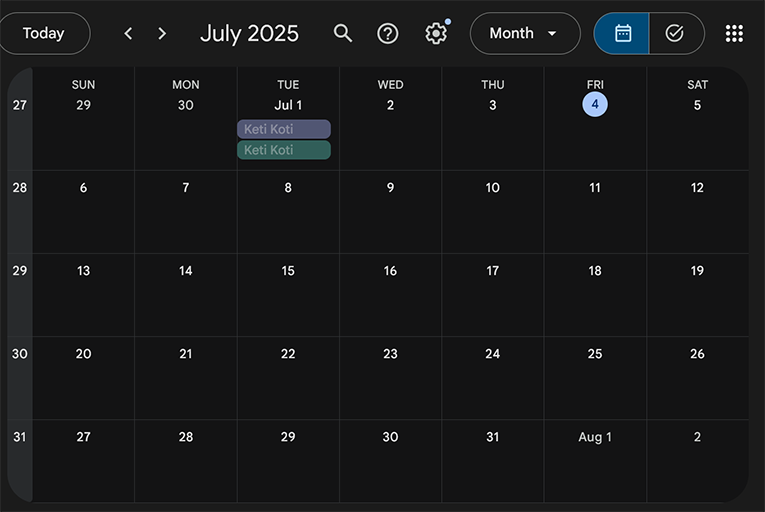
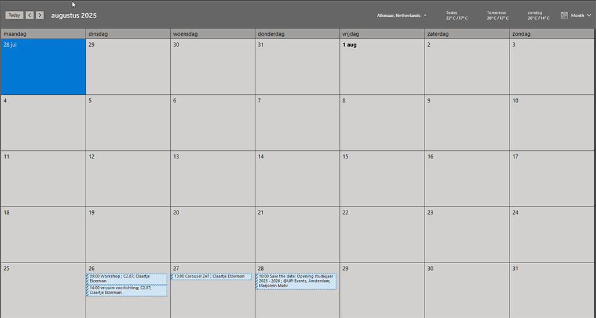

# Onderwerp
Hier hebben we de google kalender en de windows kalender. 

Als we naar deze kalenders kijken zijn er een aantal features die opvallen:
* De kalenders bestaan uit 7 kolommen. Een kolom per dag. Maandag, Dinsdag, Woensdag, Donderdag, Vrijdag, Zaterdag en Zondag. 
* Boven de kalender staat de maand (en jaar) welke wordt weergeven. 
* Er zijn knoppen om naar de volgende of de vorige maand te gaan.
* De eerste dag van de maand (1) kan op verschillende dagen in de week zijn. Niet elke maand begint op een maandag.
* Verschillende maanden hebben verschillende lengtes. Niet alle maanden zijn 31 dagen lang.
* Afspraken staan in de kalender.
* De stijl van de kalenders verschillen enorm.

Deze les gaan we de HTML en de CSS opzetten om zelf een kalender te maken.

Dat betekent dat we enkele bestanden moeten gaan aanmaken.

## Folder
Maak een map aan genaamd `M5 Skill`. In deze map komen al jouw opdrachten voor het vak *SKILL*. Maak in deze map de map voor de Kalender opdracht. 

## Bestanden
Maak de volgende bestanden aan in de map voor de **kalender opdracht**:
* index.html
* style.css
* main.js

[Volgend hoofdstuk: De HTML](2html)