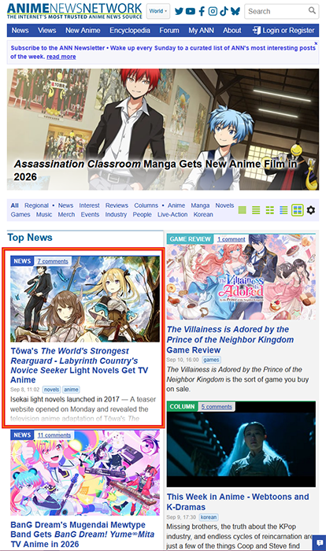
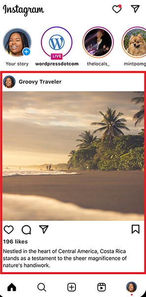
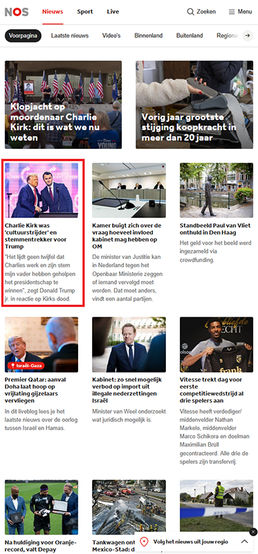
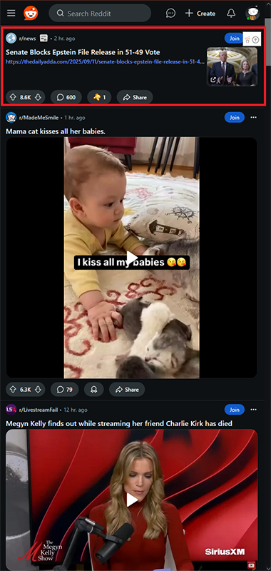

Voor deze opdracht zijn de posts op deze websites essentieel. De rest is voor deze opdracht minder belangrijk.

---

    
**Bij AnimeNewsNetwork bestaat een post uit:**
* Afbeelding
    * Hoeveelheid comments
* Titel
* Datum en tags
* Text

---

    
**Bij Instagram bestaat een post uit:**
* Naam van poster
* Afbeelding
* Buttons
* Likes
* Text

---

    
**Bij NOS bestaat een post uit:**
* Afbeelding
* Titel
* Text

---

      
**Bij Reddit bestaat een post uit:**
* Naam van subreddit
* Tijd
* Titel
* Content (evt met afbeelding)
* Buttons
    * Upvotes
    * Comments
    * Awards

---

## Opdracht: Maak de website na
Gebruik HTML en CSS om de website na te maken. Maak *maximaal 1 post* na.
* De headers, CTA enzo hoef je niet al te veel tijd in te steken.
* De prioriteit is vooral het namaken van een post.
* Gebruik placeholder info voor de post. 
    * Lorem ipsum voor text
    * Lorem picsum voor afbeeldingen
    * Willekeurige getallen voor comments.

---

## Einde les 2
Dit is het einde van les 2. Volgende les gaan we beginnen aan de javascript van Social Media.