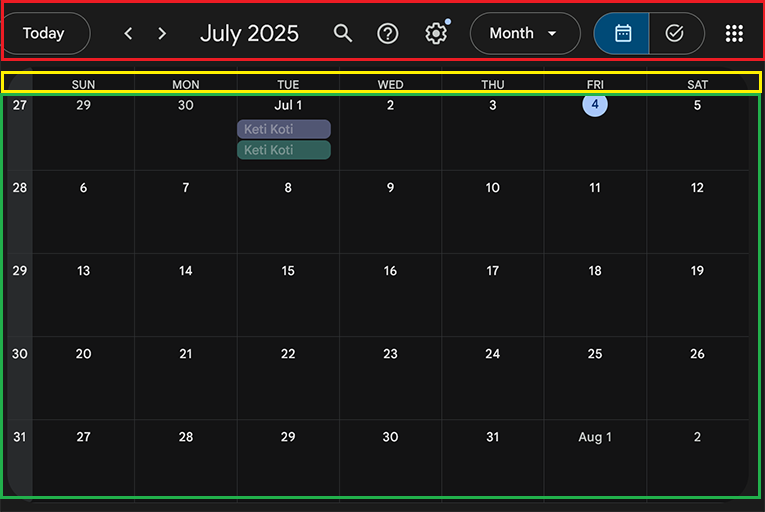

# HTML voor de Kalender
Deze eerste les gaan we alle HTML in de html doen, zodat we dit kunnen stylen en dan weten we precies hoe onze kalender er uit komt te zien. En als we weten hoe onze kalender er uit zou moeten zien kunnen we ook op tijd makkelijk problemen in de rest van de code herkennen.

## Boilerplate
Begin met het toevoegen van de html boilerplate code. In visual studio code doe je dat met `!, tab`.
Als we de boilerplate code hebben kunnen we de rest van de HTML toevoegen.

## JS en CSS
Voeg het javascript en de CSS toe. 
```html
<link rel="stylesheet" href="style.css" />
<script src="main.js" defer></script>
```
Aangezien je deze twee niet wilt laten zien, is het netjes dat dit in de **head** staat, en niet in de body.

### CSS Reset
Maak gebruik van de CSS reset om te zorgen dat de kalender er straks in elke browser hetzelfde eruit ziet.

```css
*{
    margin: 0;
    padding: 0;
    box-sizing: border-box;
}
```

## Onderdelen
De kalender bestaat uit 3 verschillende hoofd onderdelen, zoals je in deze afbeelding ziet.


* De header. Hier in staat in Google Calender's geval welke maand het is, knoppen om naar de volgende/vorige maand te gaan en nog meer knoppen.
* Een lijst met dagen van de week. MA/DI/WO/DO/VR/ZA/ZO.
* Een lijst met dagen van de maand (in 7 kolommen)

```html
<body>
    <main class="calender">
        <header class="header">
            
        </header>
        <ol class="weekdays">

        </ol>
        <ol id="days" class="days">

        </ol>
    </main>
</body>
```

## Dagen van de maand
Het belangrijkste onderdeel van de kalender is natuurlijk de dagen van de maand.
Om een goed beeld te krijgen hoe dit er uit gaat zien dan moet je enkele *list items* **toevoegen**. Voeg er 31 toe.

```html
<ol id="days" class="days">
    <li class="day">1</li>
    <li class="day">2</li>
    <li class="day">3</li>
    ...
    ...
    ...
    <li class="day">31</li>
</ol>
```

Leuke lijst, maar erg lelijk en onoverzichtelijk. Laten we dit opknappen met CSS.

```css
.days{
    display: grid;
    grid-template-columns: 100px 100px 100px 100px 100px 100px 100px;
    list-style: none;
}
```
We maken van de *days* lijst een grid met 7 kolommen. Voor de maandag, dinsdag, woensdag, donderdag, vrijdag, zaterdag en zondag. Elke kolom in 100 pixels breed. Als ik de kolommen wil aanpassen dan moet ik 7x de 100 aanpassen. Om dit makkelijk te maken kan ik ook gebruik maken van de repeat functie. `grid-template-columns: repeat(7, 100px);`. In plaats van `100px` kan je ook gebruik maken van `1fr`.

{: .note }
fr staat voor fractie. Een element neemt dan een bepaald gedeelte op van zijn parent. Als er bijvoorbeeld 2 elementen zijn met 1fr dan nemen ze allebei 1/2 van de ruimte in beslag. Als er 7 elementen met 1fr zijn dan neemt elk element 1/7 van de ruimte in beslag.

Je mag nu zelf bedenken hoe de dag elementen eruit komen te zien.

Voor de outlook style:
```css
.day{
    aspect-ratio: 3/2;
    outline: 1px solid black;
}
```
Of een wat vrolijkere stijl:
```css
.day{
    aspect-ratio: 4/3;
    margin: 2px;
    border-radius: 5px;
    background: linear-gradient(135deg, #fcf8fb 0%, #ffe0fc 100%);
}
```
[Volgend hoofdstuk: De header en weekdagen](3header.html)